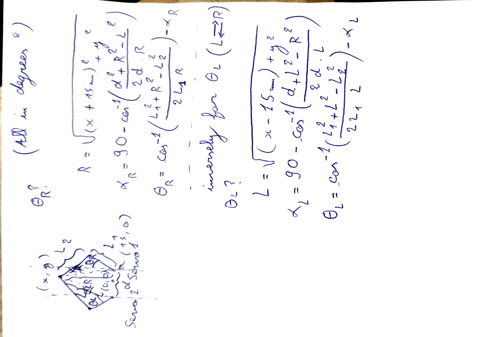

# The CNC Writer

A dual-arm CNC drawing machine powered by custom inverse kinematics (ESP32/Arduino) and a real-time Python controller built with pygame + pyserial. Draw on your screen and watch the pen replicate your strokes on paper in real time.

<p align="center">
  
  <br>
  <em>Figure 1: Inverse kinematics derivation for the dual-arm planar manipulator</em>
</p>

## Demo Video

[](https://www.youtube.com/watch?v=TJ4yLr2yl4Y)


## Features

- Dual‑arm (2‑link) planar manipulator with custom inverse kinematics firmware (ESP32/Arduino) in `inverseKinematics/inverseKinematics.ino`.
- Real‑time drawing app in `writergame.py` using pygame for UI and pyserial for streaming pen and XY waypoints.
- On‑screen stroke sampling, rate‑limited serial output, and pen up/down commands.
- Simple mapping from window pixels to the robot’s reachable workspace with limits and minimum segment distance.
- One‑key clear and safe pen‑lift on exit.

## How it works

- Firmware (ESP32): solves inverse kinematics for a 2‑link arm, receiving commands as text lines: `PEN_ANGLE X Y` (e.g., `150 10.00 120.00`). The firmware moves servos/actuators accordingly.
- Host app (Python): `writergame.py` lets you draw with your mouse. It maps screen coordinates to robot coordinates and streams waypoints with a rate limiter. Left‑click to draw; release to lift the pen; press `C` to clear and lift.

## Repository layout

```
The_CNC_Writer/
├─ writergame.py                    # pygame real‑time controller
├─ inverseKinematics/
│  └─ inverseKinematics.ino         # ESP32 firmware with IK
├─ LICENSE
└─ README.md
```

## Requirements

- Python 3.10+ (tested with 3.13 in the bundled venv)
- pygame
- pyserial
- ESP32 toolchain (Arduino IDE or PlatformIO) for flashing the firmware

Install Python deps (recommended in a virtual environment):

```
pip install pygame pyserial
```

## Quick start

1. Flash the ESP32 with `inverseKinematics/inverseKinematics.ino`.
2. Connect the machine over USB and note the serial port (default: `/dev/ttyUSB0`).
3. Edit constants at the top of `writergame.py` if needed:
   - `PORT`, `BAUD`
   - `X_MIN..X_MAX`, `Y_MIN..Y_MAX` for your workspace
   - `PEN_UP`, `PEN_DOWN` angles expected by your pen servo
   - `MIN_DISTANCE`, `RATE_LIMIT` for streaming behavior
4. Run the app:

```
python writergame.py
```

5. Draw with the left mouse button. Release to lift the pen. Press `C` to clear.

## Protocol

Each line sent over serial is:

```
<PEN_ANGLE> <X_mm> <Y_mm>\n
```

- `PEN_ANGLE`: integer servo angle (e.g., 90 = up, 150 = down)
- `X_mm`, `Y_mm`: float coordinates in the robot frame (mm). Adjust the mapping if your robot uses different units or axes.

The script applies a simple rate limit and minimum segment distance to prevent overloading the MCU.

## Safety notes

- Verify motion ranges in firmware before sending real‑time commands.
- Start with the pen up and a soft surface. Be ready to power‑off if motion is erratic.
- Tune workspace limits and link lengths to avoid singularities and self‑collision.

## Troubleshooting

- No serial connection: check `PORT`, permissions (e.g., add user to `dialout`), and cable.
- Jagged lines: lower `MIN_DISTANCE` or increase `RATE_LIMIT` spacing; check firmware interpolation.
- Mirrored/skewed output: adjust coordinate mapping or arm geometry in firmware.

## Author

- Lansari Fedi — lansarifedi7@gmail.com
- Hmidi Yesser — yesser.hmidi3@gmail.com
## License

GNU General Public License v3.0 (GPL‑3.0)
